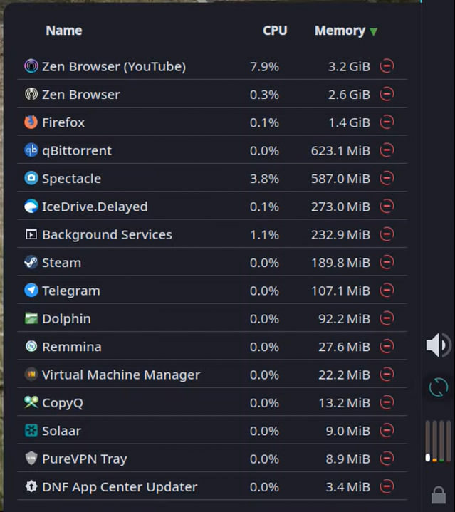

# Processor Utility

A KDE Plasma panel widget that shows a live list of running applications sorted by CPU or memory usage, with the ability to kill any process directly from the panel.




## Features

- Live application list grouped by app (not individual PIDs)
- Sortable columns: Name, CPU %, Memory
- Kill button per row — confirms before sending SIGKILL
- Popup height auto-sizes to the number of open apps
- Configurable panel icon (choose any icon from your theme)
- Optional icon colour tinting
- Configurable refresh interval

## Requirements

- KDE Plasma 6.0+
- `org.kde.ksysguard.process` (included with Plasma / KSysGuard)

## Installation

```bash
cd ~/.local/share/plasma/plasmoids/
git clone https://github.com/PlasmaDrifter/processmonitor-icon local.widget.processmonitor-icon
```

Then right-click your panel → **Add Widgets** → search for **Processor Utility**.

## Configuration

Right-click the widget → **Configure…**

| Option | Description |
|--------|-------------|
| Panel icon | Choose any icon from the system icon theme |
| Colourize icon | Tint the panel icon with a custom colour |
| Icon colour | The tint colour (only active when colourize is on) |
| Refresh interval | How often to refresh the process list (seconds) |

